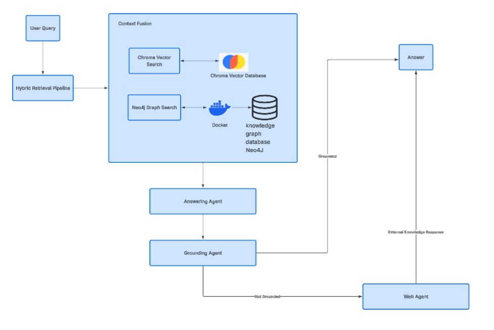
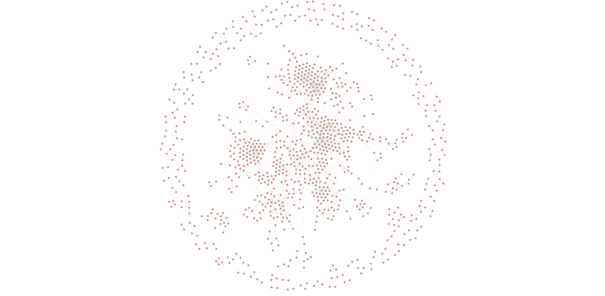

# Hybrid Graph RAG for Research Paper Question Answering

## Overview

Large Language Models (LLMs) often struggle to answer domain-specific questions accurately when relying solely on their pre-trained knowledge. While traditional Retrieval-Augmented Generation (RAG) systems improve factual accuracy through semantic retrieval, they typically lack the ability to reason over structured relationships contained within technical documents.

This project presents a **Hybrid Graph Retrieval-Augmented Generation (Hybrid Graph RAG)** pipeline that combines **vector similarity search** with **knowledge graph retrieval** to improve question answering over AI research papers.

The system extracts **text, tables, and images** from research papers, constructs both a **semantic vector index** and a **Neo4j knowledge graph**, and fuses the retrieved context to generate grounded responses. A **Grounding Agent** verifies whether the generated answer is supported by the retrieved evidence before returning it. If the answer cannot be grounded using the local knowledge base, the query is routed to a **Web Agent (LLM-based)**.

---

# Key Features

- Hybrid Retrieval (Vector + Knowledge Graph)
- Multimodal PDF Processing
  - Text Extraction
  - Table Extraction
  - Image Extraction
- Semantic Chunking
- Knowledge Graph Construction
- Context Fusion
- Grounding Verification
- Web Agent (LLM-based fallback)
- Telemetry Logging
- Benchmark Evaluation

---

## System Architecture




---

# Workflow

The complete pipeline consists of the following stages:

1. Parse research papers in PDF format.
2. Extract text, tables, and images.
3. Perform semantic chunking using an LLM.
4. Generate vector embeddings.
5. Store embeddings in ChromaDB.
6. Extract entities and relationships.
7. Build a Neo4j Knowledge Graph.
8. Perform Hybrid Retrieval.
9. Fuse graph and vector context.
10. Generate an answer using the retrieved evidence.
11. Verify the generated answer using the Grounding Agent.
12. If the answer is not grounded, route the query to the Web Agent.
13. Return the final response.

---

# Models Used

## Google Gemma 4 31B (via OpenRouter)

Used for:

- Semantic chunking
- Knowledge graph triple extraction

---

## OpenAI text-embedding-3-small

Used for:

- Semantic vector embeddings
- Vector similarity search

---

## GPT (OpenAI)

Used for:

- Answer generation
- Grounding verification
- Web Agent (LLM-based fallback)

> During development, an alternative implementation using **Gemini 2.5 Flash** was explored. GPT was used for the primary execution because Gemini occasionally encountered `RESOURCE_EXHAUSTED` rate-limit errors.

---

# Technologies Used

| Component | Technology |
|-----------|------------|
| Programming Language | Python |
| Framework | LangChain |
| Vector Database | ChromaDB |
| Graph Database | Neo4j |
| Embeddings | OpenAI text-embedding-3-small |
| Semantic Chunking | Google Gemma 4 31B (OpenRouter) |
| Answer Generation | GPT |
| Grounding Verification | GPT |
| PDF Processing | PyMuPDF |
| Document Parsing | Unstructured |
| Environment Management | python-dotenv |
| Containerization | Docker |

---

# Installation

Install all dependencies.

```bash
pip install -r requirements.txt
```

---

# Neo4j Setup

The project uses **Neo4j** as the graph database for storing entities and relationships extracted from research papers.

Neo4j is deployed using **Docker**, providing a lightweight and reproducible setup without requiring a local database installation.

Start a Neo4j container:

```bash
docker run \
  --name neo4j \
  -p 7474:7474 \
  -p 7687:7687 \
  -d \
  -e NEO4J_AUTH=neo4j/password \
  neo4j:latest
```

After the container starts:

- Neo4j Browser: http://localhost:7474
- Bolt Endpoint: bolt://localhost:7687

---

# Environment Variables

Create a `.env` file.

```text
OPENAI_API_KEY=

OPENROUTER_API_KEY=

GOOGLE_API_KEY=

NEO4J_URI=bolt://localhost:7687
NEO4J_USERNAME=neo4j
NEO4J_PASSWORD=password
```

---

# Running the Project

Launch Jupyter Notebook.

```bash
jupyter notebook
```

Open:

```
Hybrid_Graph_RAG.ipynb
```

Execute the notebook sequentially.

---

# Evaluation

The project includes an evaluation pipeline to assess retrieval and generation quality using benchmark questions.

Evaluation includes:

- Telemetry logging
- Retrieval statistics
- Benchmark question evaluation
- Grounding verification
- Unsupported query detection

---

# Example Questions

Example domain-specific questions:

- How does Reflexion use episodic memory?
- What are the components of the Reflexion framework?
- How does SELF-RAG use reflection tokens?
- How does AutoGen implement conversation programming?
- How does SkillOpt perform bounded skill updates?
- How does Ragas evaluate faithfulness?

Example out-of-domain questions:

- Who painted The Starry Night?
- What is the capital of Brazil?
- How many bones are there in an adult human body?

---

# Future Improvements

- Replace the current LLM-based Web Agent with a retrieval-enabled Web Agent using services such as Tavily or SerpAPI for real-time web search with source attribution.
- Build a Streamlit-based conversational interface.
- Add document-level citation highlighting.
- Support incremental indexing of newly uploaded research papers.
- Introduce multi-turn conversational memory.
- Integrate automated RAG evaluation using Ragas.

---

# Motivation

This project was developed to explore how semantic vector retrieval and structured knowledge graphs can be combined to improve Retrieval-Augmented Generation systems for technical literature.

By integrating multimodal document understanding, graph reasoning, and grounding verification, the system demonstrates a more reliable and explainable approach to answering research-oriented questions than traditional vector-only RAG pipelines.
